# FHIR Lab Reports
A SMART on FHIR and CDS Hooks enabled application to increase the clinical utility of pharmacogenomic laboratory test results.

This application has two parts:

1. Lab - formatting results of a laboratory test result as FHIR resources.

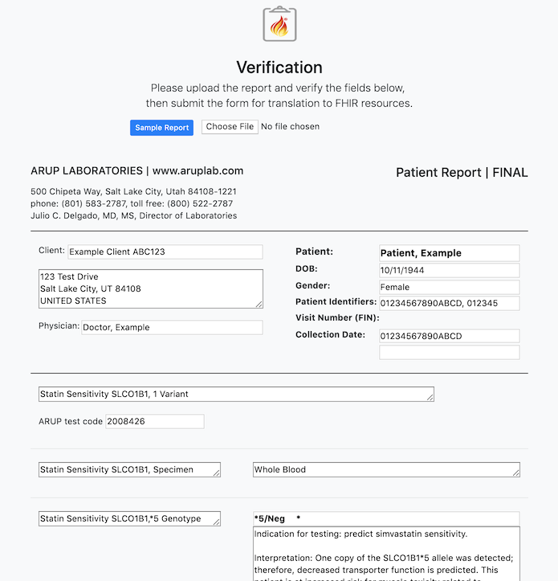            |  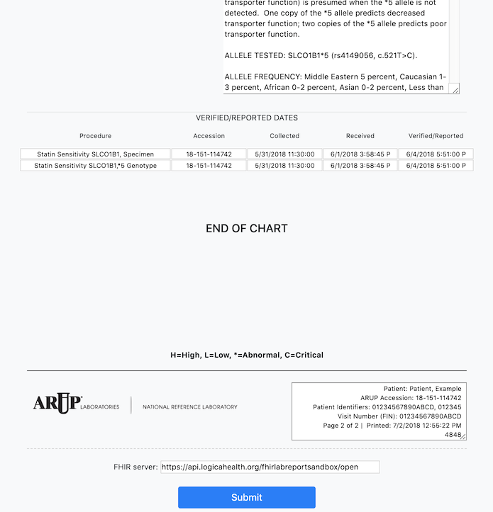
:-------------------------:|:-------------------------:

2. EHR - using those results to provide CDS.

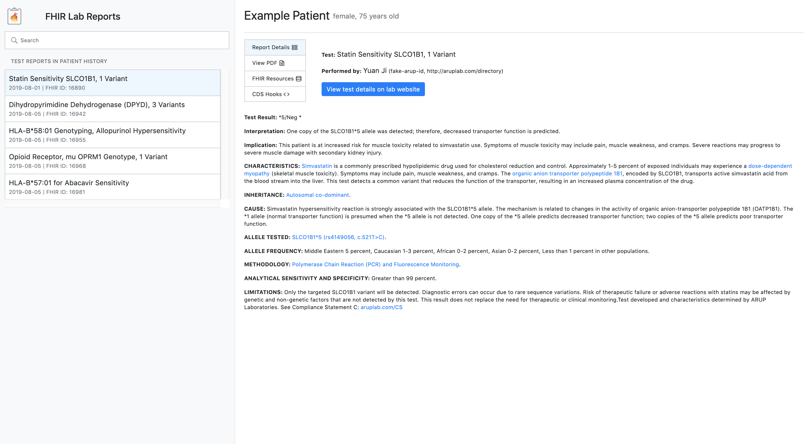

The application is also CDS Hooks enabled to ensure that those results can be hooked into all future relevant clinical encounters.

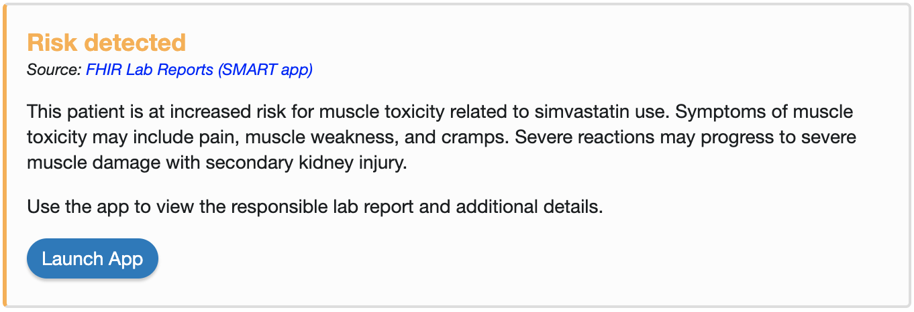

### Instructions
These examples are built with NodeJS which must be installed on your computer. On MacOS, one way is through Homebrew with the command <code>brew install node</code>.

To create the servers needed for the examples, first install the http-server tool using the command <code>npm install -g http-server</code>.

##### Create data server

This example will use the [HSPC Sandbox](https://sandbox.hspconsortium.org/).

1. Create an account.
2. Create a new sandbox with the following options and any name you would like to use.

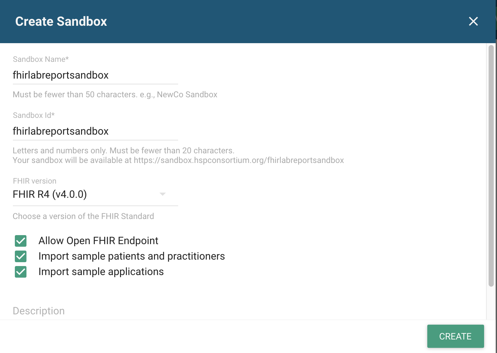

##### Launch part1-lab
Navigate to the home directory of part1-lab and launch a new server with the command <code>http-server -p 8080</code>.

Navigate your web browser to http://localhost:8080/ in order to view the example.

**Important!!** Once on the part1-lab page, <u>before</u> you submit the sample form, enter your sandbox open FHIR endpoint URL into the server field above the submit button.

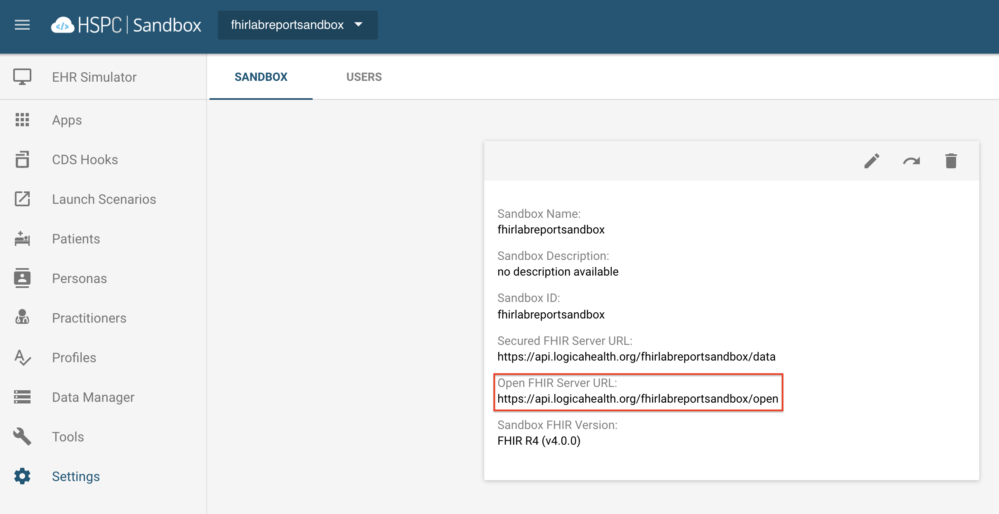

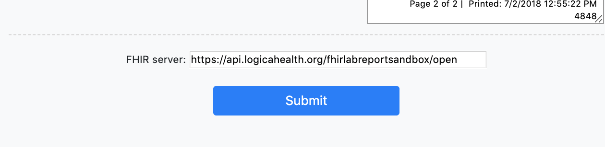

##### Launch part2-ehr

Register the app manually within your sandbox using the following parameters and leave the rest with their defaults:

    Launch URL
    http://localhost:8000/launch.html
    Redirect URL
    http://localhost:8000/index.html
    Scopes
    launch patient/*.read

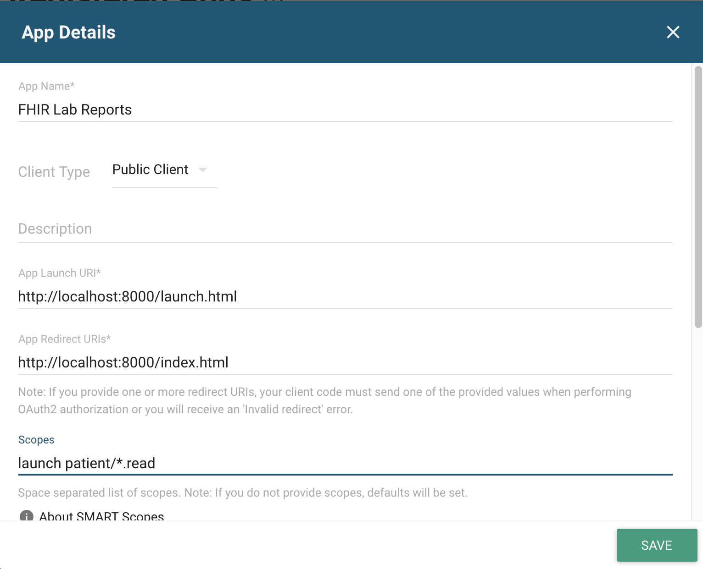

Also feel free to use <i>doc_img/icon-for-hspc.png</i> as the image for the app.

Set the client ID in <i>js/launch-smart.js</i> to the one given by the SMART service upon registering the app.

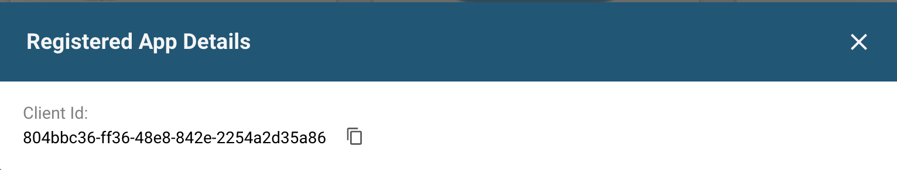

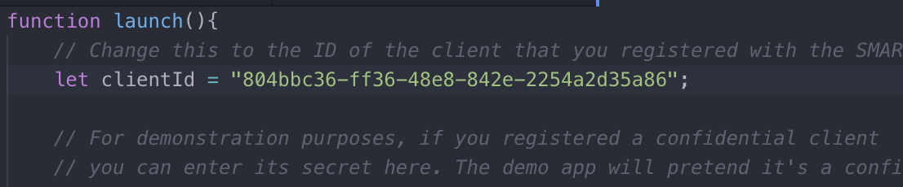

Navigate to the <i>SMART-app</i> directory of part2-ehr and launch a new server with the command <code>http-server -p 8000</code>.

Navigate to the <i>hooks-server</i> directory of part2-ehr to launch
the server which will make our app discoverable to CDS Hooks services.

We will use Docker because this server has additional dependencies.  Follow [this guide](https://docs.docker.com/install/) to install Docker on your machine and check installation success with docker -v. Then follow [this guide](https://docs.docker.com/compose/install/) to install Docker Compose and check that installation with docker-compose -v.

Launch the server with the command <code>docker-compose up --build</code>

Launch the CDS Hooks Sandbox app from the HSPC app gallery.

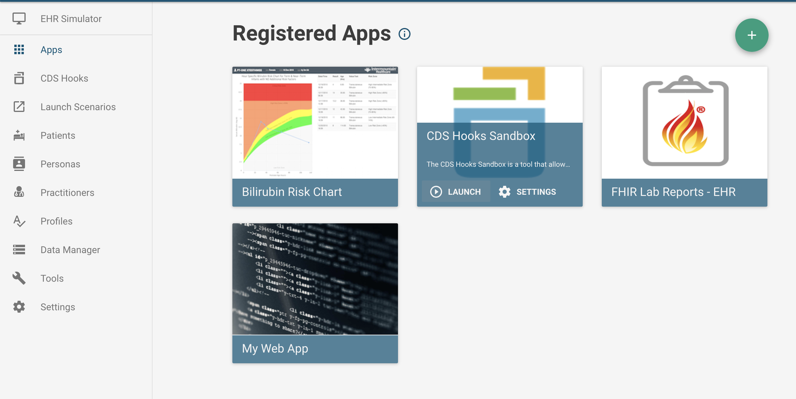

Select the patient whose report was generated in part1-lab (patient for the sample form is shown below) to perform a SMART launch.

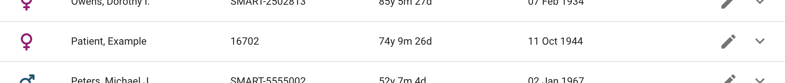

Switch to the Rx View using tab at the top of the page and register our application as a CDS service by clicking the cog in the upper-right corner.

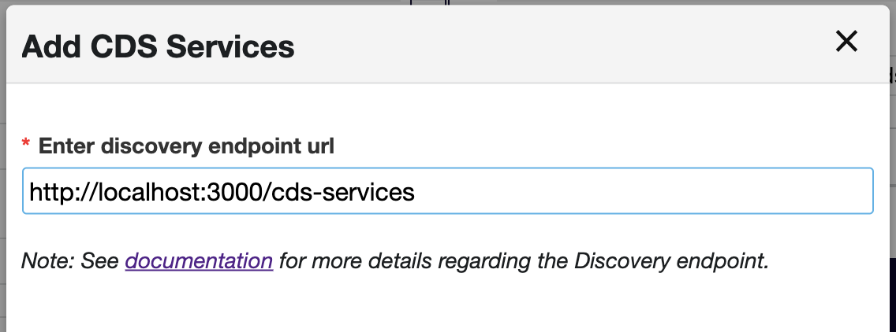

Select Simvastatin as a medication to order for the patient. The CDS Hooks sandbox mimics the ordering behavior of an EHR and so is useful in testing any implementation of CDS Hooks.

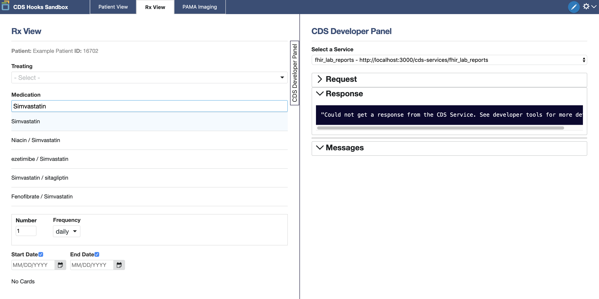

The order will return a response card with a link to launch the application.

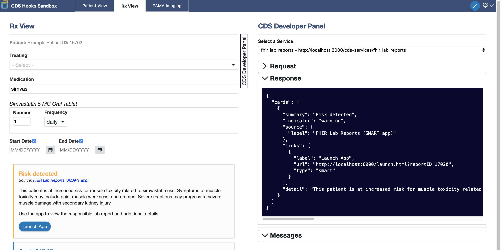

**Note:** The SMART launch can also be performed directly from the HSPC sandbox. This direct launch doesn't use CDS Hooks services. However, the same sample patient should be selected.
